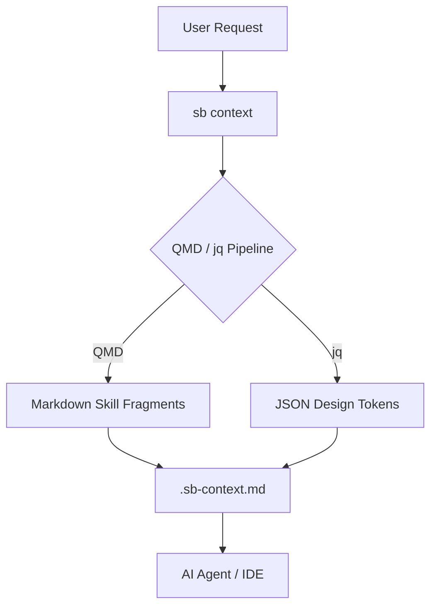

# 🚀 Skill Bridge

[](https://opensource.org/licenses/MIT)
[](https://github.com/skill-bridge/skill-bridge)

**Skill Bridge** is a high-performance, token-efficient CLI transformation engine designed for AI-native development. It shifts the paradigm from static prompt libraries to a deterministic local data pipeline.

---

## ⚡ The "Thin Pipe" Philosophy

Skill Bridge replaces legacy, heavy agent folders with a lean Bash/jq/JSON architecture and QMD-powered local RAG.

- **Token Efficiency**: Reduces prompt size by up to 75% by injecting only semantically relevant fragments.
- **Sub-second RAG**: Local context retrieval in milliseconds.
- **Zero Latency**: Lightning-fast logic engine built on `jq`.
- **IDE & CLI Native**: Works seamlessly with Google Antigravity, Cursor, Claude Code, and Gemini CLI.

---

## 🏗️ Architecture

Skill Bridge acts as a deterministic pipeline between your raw project data and the AI agent.



---

## 🚀 Quick Start

### Installation

Run the global installer to symlink the `sb` command and set up your global skills:

```bash
./install.sh
```

### Initialization

Initialize a new workspace for Skill Bridge:

```bash
sb init
```

---

## 🛠️ Command Reference

| Command | Description |
| :--- | :--- |
| `sb init` | Initialize the current workspace and check dependencies. |
| `sb context` | Generate minified context (`.sb-context.md`) using QMD + jq. |
| `sb design` | Instantly extract design tokens (colors, typography) via jq. |
| `sb audit` | Lightning-fast, regex-based code validator. |
| `sb skill` | Manage and index global/local AI skills. |
| `sb uninstall` | Safely remove Skill Bridge from your system. |

---

## 🧰 Tech Stack

- **Orchestrator**: Bash / Zsh (Zero-dependency CLI)
- **Logic Engine**: `jq` (High-speed JSON processing)
- **Retrieval Engine**: `QMD` (On-device semantic search for Markdown RAG)
- **Data Format**: JSON (Deterministic "Rosetta Stones" for UI/UX)
- **Narrative Docs**: Markdown (Indexed architectural rules)

---

## 📄 License

This project is licensed under the **MIT License**. See the [LICENSE](LICENSE) file for details.

---

> [!TIP]
> Use `sb context "your task"` to generate the most efficient context for your next AI interaction.
