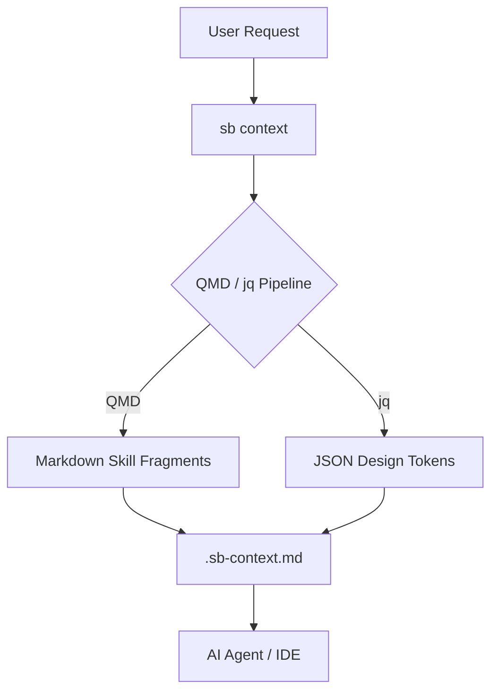

**Skill Bridge** is a high-performance, token-efficient CLI transformation engine designed for AI-native development. It shifts the paradigm from static prompt libraries to a deterministic local data pipeline.

---

## ⚡ The "Thin Pipe" Philosophy

Skill Bridge replaces legacy, heavy agent folders with a lean Bash/jq/JSON architecture and QMD-powered local RAG.

- **Token Efficiency**: Reduces prompt size by up to 75% by injecting only semantically relevant fragments.
- **Sub-second RAG**: Local context retrieval in milliseconds.
- **Zero Latency**: Lightning-fast logic engine built on `jq`.
- **IDE & CLI Native**: Works seamlessly with Google Antigravity, Cursor, Claude Code, and Gemini CLI.

---

## 🏗️ Architecture

Skill Bridge acts as a deterministic pipeline between your raw project data and the AI agent.



---

## 🚀 Quick Start

### Installation

#### Linux & macOS

Run the following one-liner to install Skill Bridge and its dependencies:

```bash
curl -fsSL https://raw.githubusercontent.com/rubiconetic/skill-bridge/main/install.sh | bash
```

#### Windows

Run the following in PowerShell (as Administrator for best results):

```powershell
powershell -c "irm https://raw.githubusercontent.com/rubiconetic/skill-bridge/main/install.ps1 | iex"
```

### Initialization

Initialize a new workspace for Skill Bridge:

```bash
sb init
```

---

## 🧰 Tech Stack

- **Orchestrator**: Bash / Zsh (Zero-dependency CLI)
- **Logic Engine**: `jq` (High-speed JSON processing)
- **Retrieval Engine**: `QMD` (On-device semantic search for Markdown RAG)
- **Data Format**: JSON (Deterministic "Rosetta Stones" for UI/UX)
- **Narrative Docs**: Markdown (Indexed architectural rules)

---

> [!TIP]
> Use `sb context "your task"` to generate the most efficient context for your next AI interaction.
